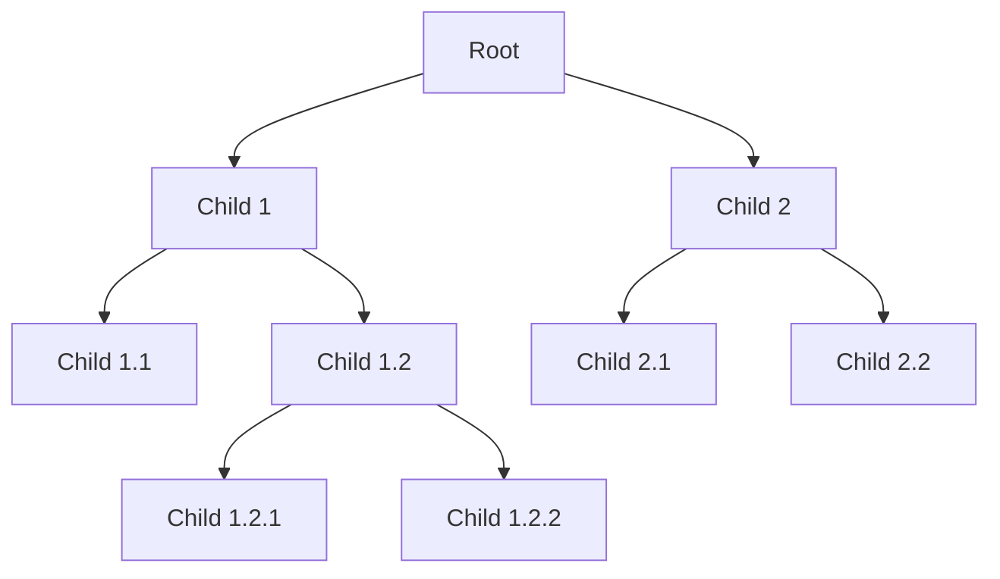

# Merkle Tree API Change Detector

This repository contains a simple Go implementation of Merkle trees and a simulation to detect API breaking changes using Merkle trees. Inspired by [ApiToolKit](https://apitoolkit.io/) by [Anthony Alaribe](https://x.com/tonialaribe), this project demonstrates how Merkle trees can be used to efficiently and securely verify data integrity and detect changes in API responses.

## Table of Contents
- [Introduction](#introduction)
- [What are Merkle Trees?](#what-are-merkle-trees)
- [Usage](#usage)
- [Running the Simulation](#running-the-simulation)
- [License](#license)

## Introduction

In the web3 and blockchain world, Merkle trees, or hash trees, are commonly used to ensure data integrity and secure data transfer. This project demonstrates a simple Go implementation of Merkle trees and how they can be used to detect breaking changes in API responses.

## What are Merkle Trees?

A Merkle tree is a hierarchical data structure where each leaf node represents a hashed value of a piece of data, and each non-leaf node is a hash of its child nodes. This structure allows for efficient and secure verification of data integrity.



## Usage

Clone the repository:

```sh
git clone https://github.com/yourusername/merkle-tree-api-detector.git
cd merkle-tree-api-detector
```

## Running the Simulation

To run the simulation:

1. Ensure you have [Go installed](https://golang.org/doc/install).
2. Navigate to the project directory.
3. Run the following command:

```sh
go run .
```

This will simulate API calls, build Merkle trees, and detect any breaking changes in the API responses.

## License

This project is licensed under the MIT License. See the [LICENSE](LICENSE) file for details.
```

This `README.md` provides a comprehensive guide for anyone looking to understand, use, and run the Merkle tree implementation and API change detection simulation.